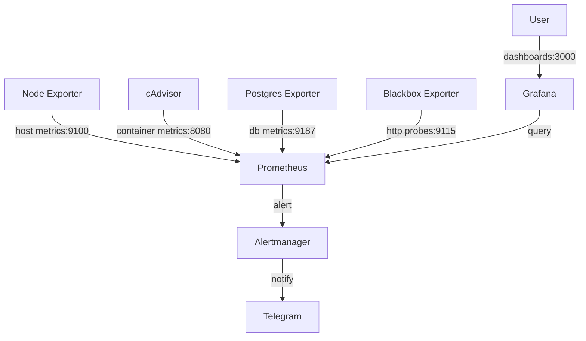

# Monitoring Stack

A containerized observability stack using Prometheus, Grafana, Alertmanager, and exporters for infrastructure and application monitoring.

## Architecture



## Quick Start

```bash
git clone https://github.com/DynamicKarabo/monitoring-stack.git
cd monitoring-stack
chmod +x scripts/setup.sh
./scripts/setup.sh
```

Or manually:

```bash
cd docker
docker compose up -d
```

## Services

| Service | Port | Description |
|---------|------|-------------|
| Prometheus | 9090 | Metrics collection & alerting |
| Grafana | 3000 | Dashboards & visualization |
| Alertmanager | 9093 | Alert routing & notification |
| Node Exporter | 9100 | Host-level metrics (CPU, memory, disk) |
| cAdvisor | 8080 | Container metrics |
| Postgres Exporter | 9187 | PostgreSQL database metrics |
| Blackbox Exporter | 9115 | HTTP/HTTPS endpoint probing |

## Available Dashboards

| Dashboard | ID | Source |
|-----------|-----|--------|
| Node Exporter Full | 1860 | https://grafana.com/grafana/dashboards/1860 |
| Docker Container | 17994 | https://grafana.com/grafana/dashboards/17994 |
| PostgreSQL | 9628 | https://grafana.com/grafana/dashboards/9628 |

Dashboards are auto-provisioned via Grafana's provisioning system — they appear automatically once Grafana starts.

## Alertmanager Setup

1. **Create a Telegram bot** — Talk to [@BotFather](https://t.me/BotFather) on Telegram and create a new bot. Save the bot token.
2. **Get your chat ID** — Send a message to your bot, then visit:
   ```
   https://api.telegram.org/bot<YOUR_BOT_TOKEN>/getUpdates
   ```
   Look for the `chat.id` value in the JSON response.
3. **Configure the receiver** — Edit `alertmanager/alertmanager.yml` and replace the placeholders:
   ```yaml
   - bot_token: 'YOUR_TELEGRAM_BOT_TOKEN'
     chat_id: YOUR_TELEGRAM_CHAT_ID
   ```
4. **Restart Alertmanager**:
   ```bash
   cd docker && docker compose restart alertmanager
   ```

## Directory Structure

```
monitoring-stack/
├── alertmanager/
│   └── alertmanager.yml          # Alert routing & Telegram config
├── docker/
│   └── docker-compose.yml        # All services definition
├── grafana/
│   ├── dashboards/               # Pre-loaded dashboard JSONs
│   │   ├── node-exporter-full.json
│   │   ├── docker-container.json
│   │   └── postgres.json
│   └── provisioning/
│       ├── dashboards/
│       │   └── dashboards.yml    # Auto-provisioning config
│       └── datasources/
│           └── datasources.yml   # Prometheus data source
├── prometheus/
│   ├── alerts/
│   │   └── common.rules.yml      # Alerting rules
│   ├── blackbox.yml              # Blackbox exporter config
│   └── prometheus.yml            # Main Prometheus config
├── scripts/
│   └── setup.sh                  # Idempotent setup script
├── .gitignore
└── README.md
```

## Alert Rules

| Alert Name | Severity | Description |
|------------|----------|-------------|
| InstanceDown | critical | A Prometheus target is unreachable |
| ServiceDown | critical | An HTTP endpoint probe has failed |
| HttpProbeFailure | warning | HTTP endpoint returning non-2xx/3xx status codes |
| HighCpuUsage | warning | CPU usage exceeds 80% for 5 minutes |
| HighMemoryUsage | warning | Memory usage exceeds 85% for 5 minutes |
| DiskSpaceLow | critical | Disk space falls below 10% |

## License

MIT
